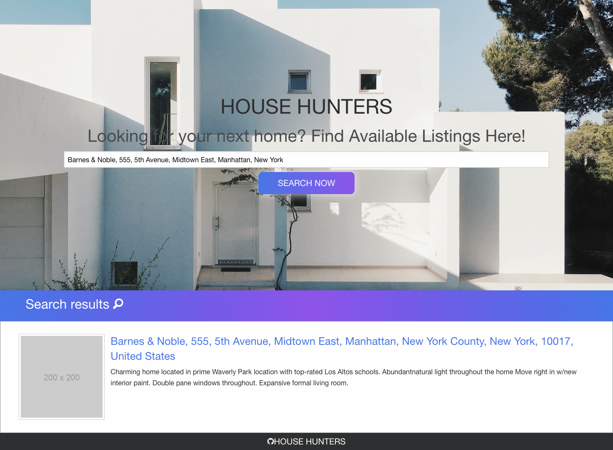

# House-Hunters

## Description

Link to deployed application
https://neilmkflyingk.github.io/house-hunters

Github link
https://github.com/neilmkflyingk/house-hunters

This house-hunters app was created as a bootcamp student project group challange. This app is a javascript house finder. The code of this app was created from scratch. 
House-hunters application uses two APIs to get search result : 
1. Geocode API (https://geocode.maps.co/). Using this API, application receive latitude and longitude from the address user typed. 

2. Zillow API 

## Table of Contents (Optional)

- [Installation](#installation)
- [Usage](#usage)
- [Requirements](#requirements)
- [Credits](#credits)
- [License](#license)

## Installation

N/A

## Requirements

No special requirements

## Usage

1. Fill in the address & press search button
2. Search results will appear
3. Click any home from the list to see full infofrmation

Screenshot located in `assets/images` folder

## Credits

Geocode API (https://geocode.maps.co/)

Image background was taken from Unsplash website. Credits : https://unsplash.com/photos/4ojhpgKpS68

## License

Please refer to the LICENSE in the repo.
